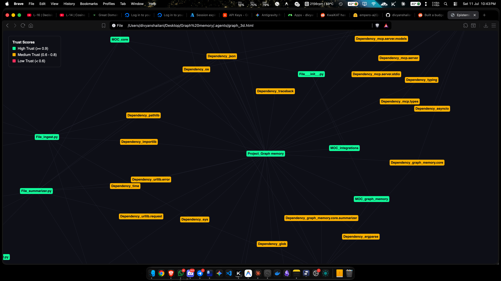
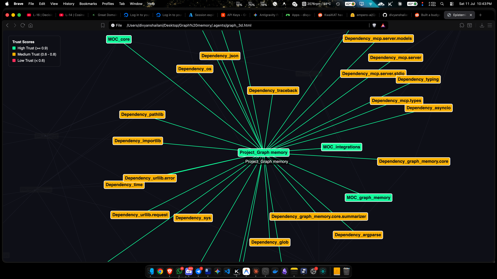

# Epistemic Graph Memory




A universal, long-term project memory tool utilizing a local SQLite graph structure to solve context amnesia for AI coding agents.

**Natively built for Antigravity (AG)**, Graph-Memory provides autonomous AI agents with a highly structured, relational brain. It is exposed universally via the **Model Context Protocol (MCP)**, meaning any framework (Claude Desktop, Cursor, Codex, Aider) can share and update the exact same graph in real-time.

## The "Brownfield" Problem & The "Skeleton-to-Meat" Architecture
When AI agents work on massive legacy ("Brownfield") codebases, traditional RAG (Retrieval-Augmented Generation) and Vector DBs fundamentally fail. Chunking code into vectors destroys the structural hierarchy of the software, and blindly asking an agent to read 10,000 files to build context will burn millions of tokens instantly.

**Graph-Memory** solves this with its revolutionary **Skeleton-to-Meat Architecture**:
1. **The Skeleton (Tree-sitter AST Scanner)**: Instantly crawl your entire codebase across 5 languages (Python, TypeScript, JavaScript, Go, Rust) in sub-second speeds. It mathematically maps out every folder, file, class, function, and import as explicit nodes and directional edges, all completely locally and for $0.00.
2. **The Meat (LLM Summarizer)**: Pass only the 1-hop structural skeletons of your component clusters (MOC Hubs) to a fast LLM (like Gemini 2.5 Flash). The LLM writes an expert-level semantic summary of the business logic of that module directly into the graph.

**Why this crushes Vector DBs**: When your agent asks "How does Auth work?", it doesn't get a random jumble of vector-matched code snippets. It hits the FTS5 SQLite index, pulls the structurally perfect `MOC_Auth` node, reads the expert LLM summary, and instantly understands the exact architecture and dependencies of your authentication module without reading a single line of raw code!

## Features
- **Polyglot AST Ingestion (`ingest-code`)**: Automatically maps legacy codebases into perfect Map-of-Content (MOC) hierarchies using Tree-sitter. Differential syncing guarantees no "Ghost Edges" when your codebase drifts.
- **Auto-Bootstrapper (`summarize-mocs`)**: Leverages an ultra-lightweight REST pipeline to auto-generate business logic summaries for your architectural clusters, gracefully handling Rate Limit and Markdown Codeblock traps.
- **Trust-Weighted Epistemic Graph**: The graph strictly tracks *when* a fact was logged, and *how* it was verified, preventing silent hallucinations.
- **Idempotent Nodes & Edges**: Agents log Tasks, Decisions, Infrastructure, and Bugs as connected nodes.
- **Obsidian-style Vis.js HTML Export**: Generate beautiful, physics-based, dark-mode graph visualizations in your browser. Stale or hallucinated nodes are visually flagged.
- **Universal State**: The database is stored locally in `.agents/graph_memory.sqlite`, meaning all MCP-compatible tools can read/write to the exact same brain simultaneously.

## Why Epistemic Graph-Memory Wins (Addressing the Critiques)

If you are an AI architect, you have probably heard these three critiques of Agentic Memory systems. Here is exactly how we engineered past them:

**1. "Just dump 150k tokens into the context window, it's enough."**
* **The Problem:** Passing 150,000 tokens on *every single request* is extremely slow and expensive. More importantly, LLMs suffer from the "Needle in a Haystack" (Lost in the Middle) phenomenon. If a critical architectural detail is buried at token 75,000, the AI often ignores it.
* **Our Solution:** Epistemic Graph Memory scales infinitely. When your agent needs to understand a module, it doesn't read the whole project. It hits the FTS5 SQLite index, pulls the structurally perfect `MOC` node and its immediate neighbors, and sends a highly concentrated, perfectly relevant 2,000-token prompt.

**2. "Graph memory is a pain because updating it is hard and messy."**
* **The Problem:** Traditional Graph RAG is notoriously hard to update. If a developer renames a file or deletes a function, relying on messy LLM guesses to update the graph usually results in a tangled web of dead links.
* **Our Solution:** We built the **Skeleton-to-Meat Architecture** and the **Orphan Sweeper**. We do *not* rely on AI guesses for the structural graph. We use a deterministic AST Parser (`tree-sitter`). When the codebase changes, our engine mathematically guarantees the structure is updated natively, and the Garbage Collector cleanly sweeps away and soft-deletes isolated nodes. It's driven by compiler logic, not AI guesses.

**3. "Automated agents hallucinate. A 0.1% error rate will eventually compound and pollute the graph."**
* **The Problem:** If an autonomous agent auto-updates the graph and hallucinates a connection even 0.1% of the time, over thousands of updates, the graph becomes a polluted mess of false memories that poisons the AI's reasoning forever.
* **Our Solution:** **Strict Trust-Weighted Scoring (`--trust`)**. We architected the system to strictly separate deterministic facts from AI-generated assumptions. Hard compiler facts (AST parsers) are assigned `Trust = 1.0`. AI-generated assumptions and automated agent actions are assigned `Trust = 0.6`. Because our query engine utilizes a `--min-trust` filter, those 0.1% automated errors are permanently quarantined at a low trust level. They literally cannot compound or pollute the core truth of the graph.

## Quickstart

### 1. Installation

You can install Graph-Memory globally via pip. We use "Extras" to safely manage AST bindings without corrupting your environment!

```bash
pip install epistemic-graph-memory        # Ultra-lightweight core
pip install epistemic-graph-memory[all]   # Installs all polyglot Tree-sitter AST bindings
```

This installs two global commands:
- `graph-memory` (The local CLI tool)
- `graph-memory-mcp` (The MCP server for AI agents)

### 2. Connect to your AI

Graph-Memory exposes the exact 9 standard MCP Tool signatures (`create_entities`, `search_nodes`, `add_observations`, etc.). This makes it a **100% Drop-In Replacement** for the official Anthropic Memory Server.

Add the following to your AI framework's configuration:

```json
{
  "mcpServers": {
    "graph-memory": {
      "command": "graph-memory-mcp"
    }
  }
}
```

---

## The Ultimate Agent Workflow

To ingest a massive, 2-year-old "Brownfield" legacy project, just run these two commands in your terminal:

```bash
# 1. Map 10,000 files into a structural skeleton in 2 seconds for $0.00
graph-memory ingest-code ./src

# 2. Spend $0.02 on API calls to write expert-level summaries for all MOC hubs
export GEMINI_API_KEY="your_api_key_here"
graph-memory summarize-mocs
```

Now, your AI agent will have perfect, high-level context of your entire architecture on day one.

---

## Pro-Tip: Enabling "Live" Auto-Updates
In Antigravity (AG), Graph-Memory is deeply integrated, meaning the agent automatically updates the database in the background without you asking.

**To get this same "Live Auto-Update" behavior in Claude Desktop, Cursor, or Codex**, you must paste the following rule into your **Project Instructions**, `.cursorrules`, or `.codexrules` file:

```markdown
# Automated Graph Memory Tracking
You have access to a `graph_memory` MCP server. You MUST proactively and automatically use the `add_node` and `add_relation` tools to track project state without the user explicitly asking you to. 

Whenever you:
1. Complete a significant task or milestone.
2. Make an architectural decision.
3. Discover or setup new infrastructure.

Quietly run the graph tools at the end of your turn to log this information so it isn't forgotten.
```
*Without this rule, Claude/Cursor will treat the graph as a purely manual tool and will only update it when explicitly asked.*

---

## Manual CLI Tools

You can interact with the graph database directly from your terminal using the installed `graph-memory` command! By default, it will look for `.agents/graph_memory.sqlite` in your current working directory.

```bash
# Ingest Code & Auto-Summarize
graph-memory ingest-code .
graph-memory summarize-mocs

# Add an Entity with JSON properties (Observations)
graph-memory add_node "Postgres_DB" "Database" '{"observations": ["Assumed based on backend code."]}'

# Add a Relation
graph-memory add_relation "Server_VM" "HAS_DB" "Postgres_DB"

# Get a Node's Subgraph
graph-memory get_node "Postgres_DB"

# Search using FTS5 Natural Language
graph-memory search "Assumed based on backend"

# Sweep and Garbage Collect Orphaned Nodes
graph-memory sweep

# Export Graph to an Interactive HTML file
graph-memory export_html my_graph.html
```

## Advanced Configuration

You can override the default database location by setting the environment variable:
```bash
export GRAPH_MEMORY_DB_PATH="/path/to/my_global_brain.sqlite"
```
