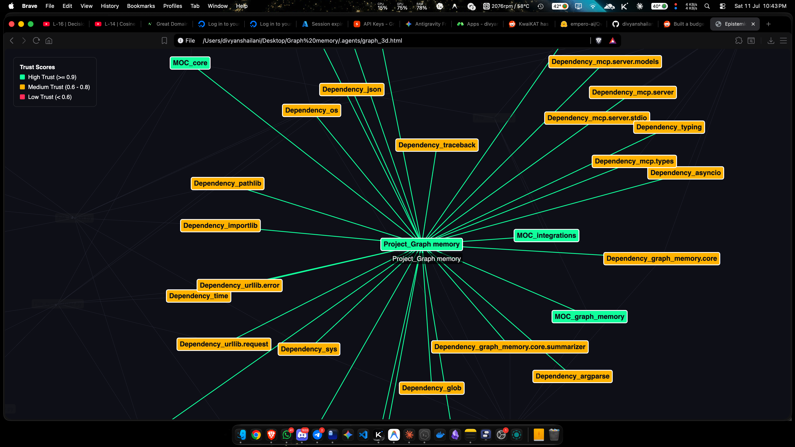

# Epistemic Graph Memory (v3.0.0)



A universal, long-term project memory and structural context tool for AI coding agents (Antigravity, Hermes, Claude, Cursor, Codex, OpenHands, Ollama).

**Epistemic Graph Memory** provides a local, SQLite-backed knowledge graph with **Dynamic Epistemic Trust Decay**, **First-Class Decision Audit Ledgers**, **Codebase AST Call-Graph Awareness**, **Hermes-Class Prompt Snapshots**, and **Continuous Micro-Compaction**.

Exposed natively via the **Model Context Protocol (MCP)** and CLI.

---

## 🌟 Core Features (v3.0.0)

### 1. 🌲 Hermes-Class Declarative Memory & Auto-Recall Snapshots
* **Prompt-Cache Friendly Snapshots (`graph-memory snapshot`)**: Automatically generates ultra-dense, 500-token Markdown snapshots of active, high-trust graph facts (`effective_trust >= 0.7`) and recent milestones to inject into LLM system prompts on session startup.
* **Continuous Micro-Compaction (`distill_session`)**: Based on Hermes Agent micro-compaction principles, **verbatim user intent is preserved**, while large assistant tool outputs and file reads are continuously distilled into structured graph facts.
* **Episodic Session Logging & FTS5 Search (`search-sessions`)**: Logs all multi-session conversation history into SQLite FTS5 for zero-friction historic turn retrieval.

### 2. ⏳ Dynamic Epistemic Trust Decay
* **Cognitive Forgetting Math**: Calculates dynamic, query-time trust decay without mutating baseline data:
  $$\text{Effective Trust} = \text{Base Trust Score} \times \left(0.5^{\frac{\Delta t}{30.0}}\right)$$
* **Automatic Re-Verification**: Re-verifying a node or re-parsing code updates `last_verified_at = now()`, immediately restoring effective trust to **100%**.
* **Decay Retrieval Filtering**: `search_nodes` and `serialize_subgraph` automatically filter out stale entities below `min_trust`.

### 3. 📜 First-Class Multi-Agent Decision Ledger
* **Append-Only Audit Trail (`Decision_Ledger`)**: Tracks *which* agent made *what* decision, *why* (rationale), and *when*.
* **CLI & MCP Querying**: Query decision history by agent, node ID, or timeframe (`graph-memory query-history --agent Hermes`).

### 4. 🔍 Codebase AST & Call Graph Awareness
* **Polyglot AST Ingestion (`ingest-code`)**: Deterministic parsing of Python, TypeScript (`.ts`, `.tsx`), JavaScript (`.js`, `.jsx`), Go, and Rust repositories via Tree-sitter.
* **Production Call Graphs & Inheritance**: Extracts function call chains (`Func_A -[CALLS]-> Func_B`) and class inheritance (`Class_Sub -[EXTENDS]-> Class_Base`).
* **Code Snippets & Line Bounds**: Extracts exact function signatures, docstrings, line bounds (`L10-L45`), and code snippets (`read_code_snippet`).
* **<5ms Single-File Re-parsing (`ingest-file`)**: Incremental single-file re-parsing for instant updates during editing.
* **Ghost Component Pruning**: Automatically prunes obsolete function/class nodes when source files are updated.

### 5. 🔀 Entity Merging & Canonical Pointers
* **Soft-Delete Merging (`merge_nodes` / `merge`)**: Merges duplicate entities with canonical pointer resolution (`resolve_canonical_id`), alias array tracking, and full history propagation.

### 6. 🎨 2D & GPU-Accelerated 3D Visualizations
* **Interactive HTML Export (`export_html`)**: Visualizes graph nodes, relationships, and trust scores in interactive 2D.
* **3D WebGL Viewer (`export-3d`)**: GPU-accelerated 3D force-directed graph visualizer (`vis-network@9.1.9`).

---

## 📦 Installation

```bash
pip install epistemic-graph-memory[all]
```
*Note: The `[all]` extra installs polyglot Tree-sitter AST parser bindings.*

---

## 🔌 MCP Server Configuration

To use Epistemic Graph Memory natively inside Claude Desktop, Cursor, Antigravity, Hermes, or Codex, add the following to your MCP configuration:

```json
{
  "mcpServers": {
    "graph-memory": {
      "command": "graph-memory-mcp"
    }
  }
}
```

### Streamable HTTP Transport (v3.6.0)

For harnesses that only support remote MCP servers (OpenCode) or remotely hosted / Dockerized agents:

```bash
graph-memory-mcp-http                     # http://127.0.0.1:8765/mcp
GRAPH_MEMORY_HTTP_HOST=0.0.0.0 GRAPH_MEMORY_HTTP_PORT=9000 graph-memory-mcp-http
```

Stateless session mode — safe for multiple concurrent agents on one endpoint. Health check at `/health`. Requires the `http` extra (`pip install epistemic-graph-memory[http]`).

---

## 📥 Memory Import & Export (v3.6.0)

Zero-cost migration from the memory formats you already have, and a browsable vault out:

```bash
# Import CLAUDE.md / AGENTS.md / .cursorrules / any markdown memory (sections -> Knowledge_Nodes)
graph-memory import-md CLAUDE.md
graph-memory import-md .cursorrules

# Import a mem0 JSON export (records -> Fact_Nodes)
graph-memory import-mem0 mem0_export.json

# Export curated knowledge as an Obsidian vault with [[wikilinks]] for graph edges
graph-memory export-obsidian ~/vaults/graph-memory
```

---

## 🪝 Framework Auto-Memory Bindings & Lifecycle Hooks (v3.5.0)

One command wires Graph Memory into your agent harness — with **automatic lifecycle capture** where the harness supports event hooks, and an MCP + instruction protocol everywhere else:

```bash
graph-memory hook install                # all frameworks
graph-memory hook install --framework zcode
graph-memory hook status
graph-memory hook refresh                # re-render snapshots now
```

| Framework | Integration | What happens automatically |
| :--- | :--- | :--- |
| **Claude Code** | Event hooks in `~/.claude/settings.json` + auto-context file | PostToolUse → incremental AST ingest of edited files; Stop → transcript distillation into Session_Logs + fact graph; SessionStart → snapshot refresh |
| **ZCode** | Event hooks in `~/.zcode/cli/config.json` (`hooks.enabled: true`) | Same three-event lifecycle via portable `process` hooks |
| **Codex** | Rule file + MCP entry in `~/.codex/config.toml` | Snapshot injection + lifecycle protocol; MCP tools for search/ingest/distill |
| **Cursor** | Rule (`.mdc`) + MCP entry in `~/.cursor/mcp.json` | Snapshot injection + lifecycle protocol via MCP tools |
| **Antigravity** | Skill file (`AUTO_MEMORY.md`) | Snapshot injection + lifecycle protocol |
| **Qoder** | Rule file (`~/.qoder/rules/`) | Snapshot injection + lifecycle protocol |
| **OpenCode** | Marked section in `AGENTS.md` + remote MCP entry in `opencode.json` | Snapshot injection + lifecycle protocol + native MCP tools via `graph-memory-mcp-http` |
| **Hermes** | `MEMORY.md` auto-sync section | Snapshot sync on install/refresh |
| **Claude Desktop** | Env flag on the MCP entry | `GRAPH_MEMORY_AUTO_SNAPSHOT=1` |

The lifecycle is powered by a **harness-agnostic dispatcher** — any harness that can run a shell command on events can use it:

```bash
echo '{"hook_event_name": "PostToolUse", "tool_name": "Write", "tool_input": {"file_path": "src/main.py"}}' | graph-memory hook-event
```

Events handled: `PostToolUse` (auto-ingest edited file, <5ms), `Stop`/`SessionEnd` (log transcript tail into FTS5 Session_Logs, distill facts, refresh snapshots), `SessionStart` (refresh all installed snapshot files).

---

## 🚀 Quickstart

### 1. Ingest Codebase AST & Build Graph
```bash
# Parse full codebase AST, call graphs, and inheritance
graph-memory ingest-code .

# Incrementally re-parse a single modified file (<5ms)
graph-memory ingest-file graph_memory/core/engine.py --agent Antigravity --rationale "Refactored trust decay"
```

### 2. Generate Active Prompt Snapshot (Hermes Auto-Recall)
```bash
# Output prompt-cache friendly Markdown snapshot for system prompt injection
graph-memory snapshot --max-tokens 600 --min-trust 0.7
```

### 3. Query Decision History & Search
```bash
# Query agent decision audit ledger
graph-memory query-history --agent Hermes --limit 10

# FTS5 search across graph nodes
graph-memory search "effective trust"

# FTS5 search across episodic session logs
graph-memory search-sessions "tree-sitter fallback"
```

### 4. Graph Maintenance & 3D Visualization
```bash
# Lint for orphan nodes and dangling edges
graph-memory lint --fix

# Perform SQLite database vacuum
graph-memory consolidate

# Export WebGL 3D GPU-Accelerated Graph Viewer
graph-memory export-3d memory_3d.html
```

---

## 🛠️ MCP Tool Reference

| MCP Tool | Description |
| :--- | :--- |
| `get_active_snapshot` | Returns prompt-cache friendly Markdown snapshot of active high-trust graph facts. |
| `distill_session` | Performs continuous micro-compaction and fact distillation on session turns. |
| `search_session_history` | Searches historical conversation transcripts using SQLite FTS5. |
| `query_decision_history` | Queries global `Decision_Ledger` by agent, node ID, or timeframe. |
| `read_code_snippet` | Retrieves exact AST signature, docstring, line bounds, and source code snippet. |
| `ingest_file` | Incrementally re-parses a single changed file into the AST graph (<5ms). |
| `merge_entities` | Merges source entity into target entity with canonical pointer redirect. |
| `create_entities` | Creates multiple entities with trust scores and observation payloads. |
| `create_relations` | Creates directional relations between entities with trust metrics. |
| `search_nodes` | FTS5 search across entity names, types, and observation content. |
| `open_nodes` | Serializes subgraphs around specific central nodes. |
| `read_graph` | Serializes complete knowledge graph. |

---

## 💡 Architecture Protocols

### Entity Ontologies
- **`Fact_Node`**: Ground-truth facts derived deterministically from AST, Git, or session distillation.
- **`Knowledge_Node`**: High-level architecture, module summaries, and design decisions.
- **`Episode_Node`**: Workflows, completed task sequences, and milestone records (linked with `FOLLOWED_BY` edges).
- **`Release_Node`**: Formally published software versions and package release records.

---

## 📜 Lineage & Acknowledgments

Graph-Memory was inspired by the [Open Knowledge Format (OKF)](https://github.com/GoogleCloudPlatform/knowledge-catalog/tree/main/okf) and the **Hermes Agent** memory architecture.

* **SQLite WAL & FTS5**: Powered by local SQLite WAL mode for concurrent multi-agent safety and FTS5 for high-speed indexing.
* **Tree-Sitter**: Powered by Tree-sitter for polyglot AST parsing.

---

## 📄 License
MIT License. Created by Divyansh Ailani.
